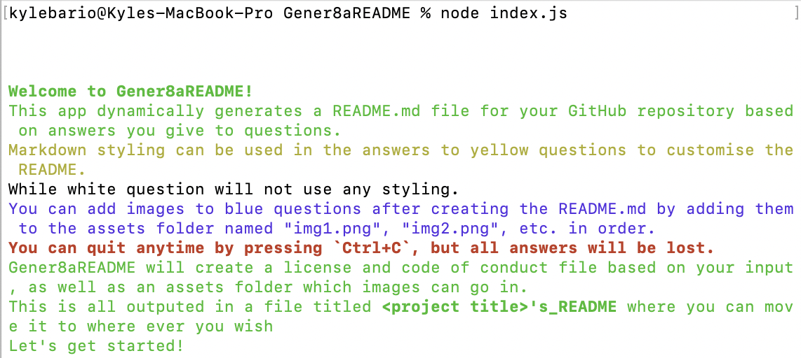
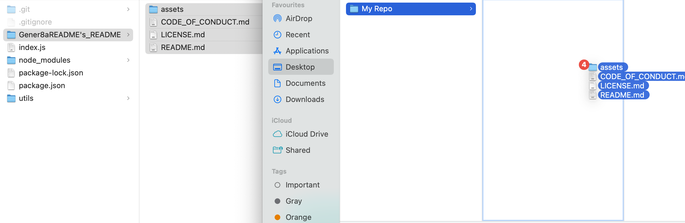

# Gener8aREADME

## Description
Gener8aREADME dynamically creates a README.md file for your open-source github repository based on inputs you give in the command line.

I created Gener8aREADME because README's are crucial aspects of an open-source repo because it is the first thing people look at when viewing your repo, giving an insight into your professionalism as a developer, your skills as a programmer and the tools that other developers need to contribute to the project. If any of these things are not up to standard, you risk people not contributing to your project or others not taking you seriously.

By automating the production of a README from a professional template - such as that that Gener8aREADME works off of - you garuantee that all the bases of a good README are covered, allowing you to focus on the developing of the project.

Gener8aREADME was developed using JavaScript, Node.js and Inquirer.

## Table of Contents
- [Installation](#installation)
- [Usage](#usage)
    - [Create a README](#create-a-readme)
    - [Colour-Coded Questions](#colour-coded-questions)
    - [Using Gener8aREADME's Output](#using-gener8areadmes-output)
- [Contribute to Gener8aREADME](#contribute-to-gener8areadme)
- [Tests](#tests)
- [Questions](#questions)
- [Credits](#credits)
    - [Tutorials](#tutorials)
- [License](#license)

## Installation
You can clone the repo of Gnere8aREADME from my github. Navigate to the directory/file you wish to store the repo in the command line and run the following code:

    git clone https://github.com/kbario/Gener8aREADME.git

## Usage

### Create a README

To create a README using Gener8aREADME, navigate to the directory of the repo you cloned on your local machine and run the code below. This will initialise Gener8aREADME and you should see the greeting message below.

    node index.js

### Colour-Coded Questions

The questions of Gener8aREADME are coloured based on what features they offer you.

- **Neutral** (black and white) questions are exactly that, there is not functionality to these qustions.

- **Yellow** questions indicate that you can add markdown-like styling to the README in these sections to further customise the file.

- **Blue** questions indicate that - if answered yes - you can add files to the assets folder created with the README and they will automatically be added to the README. This is a useful feature as you can add images for the usage, etc. to futher engage readers about your project.

 - Finally, **Green** text is also used in the application to indicate introductions to sections and general information.

### Using Gener8aREADME's Output

Once you've answered all the quesitons, the application will output a file titled <your-project's-title>'s_README. Inside this file will be your README.md, your License that you chose, a code of conduct file (optional), and an assets file. If you answered yes to a blue question or questions, add the associated images in this file named 'imgOne.png', etc. based on how many blue questions you said yes to. NOTE: if you added an image to section 1 and 3 of usage but not two, the images will need to be named imgOne.png and imgThree.png.

From there, your README is set up, and you can add it along with the other accompanying files directly into your github repo. **Happy README-ing!** :)

## Contribute to Gener8aREADME

All contributions to Gener8aREADME are greatly appreciated and contributing is one of the many amazing things about open-source software.

To contribute to Gener8aREADME, all we ask is that you're empathic and supportive towards other developers and follow the standard contribution guidelines. Click the banner below for more information.
        

## Tests
    git clone https://github.com/kbario/Gener8aREADME.git

    node index.js

## Questions
If you have any questions, feel free to contact me through my [GitHub](https://github.com/kbario/) or [Email me](mailto:kylebario1@gmail.com).

## Credits
Below is a list of links to tutorials that were used to create this project.

### Tutorials
- https://pakstech.com/blog/inquirer-js/
- https://tforgione.fr/posts/ansi-escape-codes/
- https://askubuntu.com/questions/533302/how-to-write-literal-n-in-a-file-as-text-from-the-terminal
- https://choosealicense.com/licenses/
- https://coding-boot-camp.github.io/full-stack/github/professional-readme-guide

## License
Licensed under the [MIT](./LICENSE.txt) license.

