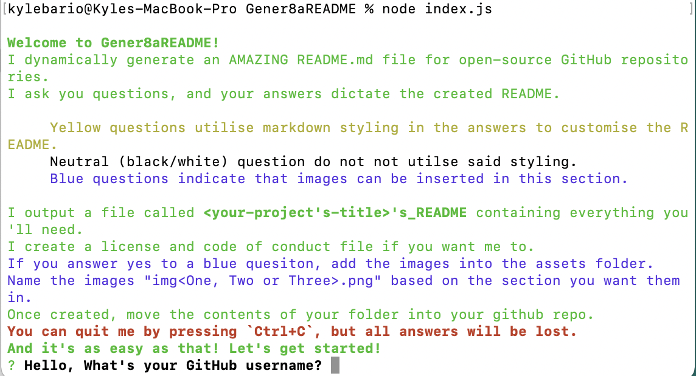
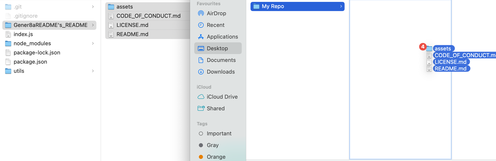

# Gener8aREADME

## Description
Gener8aREADME is a CLI application that dynamically creates README.md files for open-source GitHub repositories based on user's input into the command line.

Having high-quality READMEs in your GitHub repos is crucial as a developer, because people get:

 - Enjoyment out of reading your READMEs and are more likely remember and comeback to your profile in the future,

 - A deeper understanding of what your project is about, making it easier for them to contribute and propel your projects, and

 - A greater sense of professionalism from your profile which will drastically improve career prospects.

I created Gener8aREADME to ensure that all my READMEs are of the highest quality possible and reap the benefits outlined above as well as so I could devote more of my time to actually working on my projects.

Gener8aREADME was developed using JavaScript, node.js, and Inquirer.

## Table of Contents
- [Gener8aREADME](#gener8areadme)
  - [Description](#description)
  - [Table of Contents](#table-of-contents)
  - [Installation](#installation)
  - [Usage](#usage)
    - [Starting the Application](#starting-the-application)
    - [Colour-Coded Questions](#colour-coded-questions)
    - [Using the Output of Gener8aREADME](#using-the-output-of-gener8areadme)
  - [Contribute to Gener8aREADME](#contribute-to-gener8areadme)
  - [Tests](#tests)
  - [Questions](#questions)
  - [Credits](#credits)
    - [Tutorials](#tutorials)
  - [License](#license)

## Installation
At present, to utilise Gener8aREADME you will simply need to clone the github repo to your local machine. Navigate to the directory you wish to store Gener8aREADME and run the code:

    git clone https://github.com/kbario/Gener8aREADME.git

## Usage

### Starting the Application

To use this app, navigate to where the repo is on your local machine and run the code:

    node index.js

### Colour-Coded Questions

To increase customisation of the README with little effort, questions have been styled to represent functionalities they possess.

 - **Green** writing indicates information and headings to separate segments of questions. There is no functionality to green writing 
 - **Yellow** question indicate that the answers accept markdown styling. As the final README is a markdown file, adding common styling such as surrounding words with double *, italising with single *, and even creating lists with line breaks and '-'. A custom function of Gener8aREADME is you can add line breaks by using the key word %nl%. Add new lines in code blocks using %nlc% and in list using %nll%. This gives amazing results with little effort.
 - **Blue** questions indicate that - if answered yes to - they will insert an image placeholder. Once the README is created, you can add PNG files to your the assets folder inside your README folder, and they will automatically show up in your README. The only requirement for this is that you must label them imgOne.png, imgTwo.png and imgThree.png depending on what section you want them to go in.
 - **Extending this**: If you want more than the default three sections in your README, as the layout is already set up for you, you can easily copy and paste the usage subsections, change the image links/names and create more sections.

### Using the Output of Gener8aREADME

The output of this app is a folder named your-projects-title's_README. Inside this folder you will find your:

 - full customised README.md,
 - a LICENSE.md containing the license you chose,
 - a CODE_OF_CONDUCT.md file if you opt for the industry standard,
 - as well as an assets folder for you to place your images (if you opted for them).

From there, you can easily drag and drop these files/folder into your github repo and you're good to go! **Happy README-ing! :)**

## Contribute to Gener8aREADME

All contributions to Gener8aREADME are greatly appreciated and contributing is one of the many amazing things about open-source software.

To contribute to Gener8aREADME, all we ask is that you're empathic and supportive towards other developers and follow the standard contribution guidelines. Click the banner below for more information.
        

## Tests
    git clone https://github.com/kbario/Gener8aREADME.git

    node index.js

## Questions
If you have any questions, feel free to contact me through my [GitHub](https://github.com/kbario/) or [Email me](mailto:kylebario1@gmail.com).

## Credits
Below is a list of links to tutorials that were used to create this project.

### Tutorials
- https://pakstech.com/blog/inquirer-js/
- https://choosealicense.com/licenses/
- https://tforgione.fr/posts/ansi-escape-codes/
- https://askubuntu.com/questions/533302/how-to-write-literal-n-in-a-file-as-text-from-the-terminal
- https://coding-boot-camp.github.io/full-stack/github/professional-readme-guide

## License
Licensed under the [MIT](./LICENSE.txt) license.

---
This README was created with [Gener8aREADME](https://github.com/kbario/Gener8aREADME).
